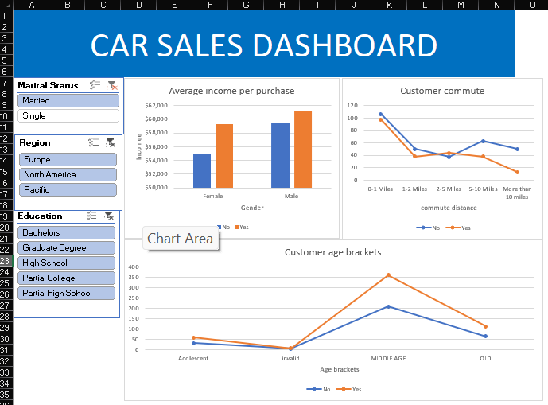

# Customer-Purchase-Behavior-Analysis-using-Excel-Dashboard
Excel-based customer data analysis with interactive dashboard using pivot tables and slicers.
# 📊 Customer Purchase Behavior Analysis using Excel Dashboard

## 📌 Project Overview
This project focuses on analyzing customer purchase behavior using **Microsoft Excel**. It demonstrates how raw customer data can be transformed into meaningful insights through **data cleaning, pivot table analysis, and interactive dashboards**.

The main goal of this project is to understand how different factors such as **income, age, commute distance, education, and region** influence customer purchasing decisions.

---

## 🎯 Objectives
- Clean and preprocess raw dataset  
- Standardize inconsistent data values  
- Create meaningful features (Age Brackets)  
- Perform analysis using Pivot Tables  
- Build an interactive dashboard  
- Generate business insights from data  

---

## 📂 Dataset Description
The dataset contains customer-related information, including:

- Gender  
- Marital Status  
- Income  
- Age  
- Education  
- Occupation  
- Number of Cars  
- Commute Distance  
- Region  
- Purchase Decision  

---

## ⚙️ Data Preprocessing Steps
The following steps were performed on the dataset:

- Removed duplicate records  
- Replaced categorical values:
  - `M → Male`  
  - `F → Female`  
  - `S → Single`  
- Converted income into currency format  
- Simplified numeric values by removing decimals  
- Created a new column **"Age Brackets"** using IF formula:
  - Adolescence  
  - Middle Age  
  - Old Age  

---

## 📊 Data Analysis
Data analysis was performed using **Pivot Tables**:

- Average income of customers  
- Customer commute distance analysis  
- Age bracket distribution  
- Comparison of purchasing behavior  

---

## 📈 Dashboard Features
An **interactive dashboard** was created to visualize insights:

- 📊 Charts (Bar, Column, Pie)  
- 🎛️ Slicers for filtering:
  - Marital Status  
  - Region (Europe, North America, Pacific)  
  - Education Level  

- 🔗 Report connections to control all charts simultaneously  

---

## 🔍 Key Insights
- Customers with higher income tend to purchase more  
- Middle-aged customers show higher purchasing behavior  
- Commute distance influences buying patterns  
- Interactive filtering helps in better analysis  

---

## 🛠️ Tools & Technologies Used
- Microsoft Excel  
- Pivot Tables  
- Charts & Graphs  
- Slicers  
- Dashboard Design  

---

## 🖼️ Project Output (Dashboard)

> 📌 *Note: Replace `dashboard.png` with your actual uploaded image name*

---

## 🚀 How to Use
1. Download the Excel file from this repository  
2. Open it in Microsoft Excel  
3. Navigate to the **Dashboard Sheet**  
4. Use slicers to filter data:
   - Marital Status  
   - Region  
   - Education  
5. Observe how charts update dynamically  

---

## 📌 Project Structure
